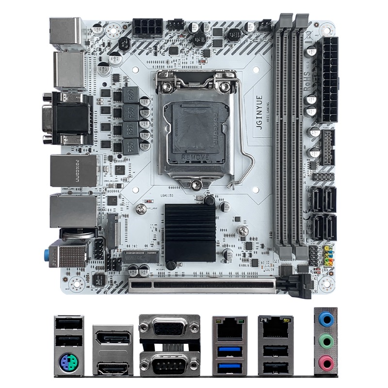

# Hackintosh 精粤JGINYUE H97i-Gaming

 

## 硬件 / Hardware
| 项目 | 内容 | 备注 |
| ----- | ----- |-----|
| 处理器 / CPU | Intel i7-4790 ( 4C - 8T ) | 4代Haswell架构 |
| 主板 / MB | JGINYUE H97i-Gaming | 内存为DDR3 |
| 内存 / RAM | 酷兽 CUSO 8GB*2 DDR3 1600 Mhz | 便宜又好用 |
| 显卡 / DGPU | 昂达 AMD Radeon RX 560 | 闲鱼款，便宜，免驱 |
| 有线网络1 / Lan1 | Realtek RTL8111H | 千兆网络 |
| 有线网络2 / Lan2 | Realtek RTL8111H | 千兆网络 |
| 无线 + 蓝牙 : Wifi + Bluetooth | 博通 BCM94360CS2+M.2转接线 | 免驱 |
| 音频 / Audio | Realtek ALC897 | 需要IRQ补丁 |
| 固态硬盘 / NVMe | 西部数据 WD SN720 512GB | 闲鱼二手 |
| 处理器散热 / CPU Fan | 海盗船 H60 120水冷 | 闲鱼二手 |
| 电源 / Power | 全汉FSP-MS450 450瓦 全模组 |  |
| 机箱 / Case | 开放式机箱 |  |
 

## 软件 / Software
| 项目 | 内容 | 备注 |
| ----- | ----- | ----- |
| SMBIOS | iMac17,1 | 也可以MacPro7,1 |
| BootLoader | OpenCore 0.9.7 | 最新 |
| macOS | Monterey | 虽然13，14也可以，但是12支持更多 |
 

## 工作情况 / Fuctional
### 视频 / Display
|| 项目 | 内容 | 备注 |
|-----| ----- | ----- | ----- |
|✅| 核显 | HD4600 | 12代可以驱动 |
|✅| 独立显卡 | RX560 | 需要定制参数可以支持HEVC硬解 |
 

### 音频 / Audio
|| 项目 | 内容 | 备注 |
|-----| ----- | ----- | ----- |
|✅| 音频 | ALC897 | 加上IRQ补丁后，可驱动，对应ID为66； |
 

### 电源管理、睡眠、休眠 / Power, Sleep and Hibernation
✅ 电源管理使用 `SSDT-PLUG-DRTNIA` 即可解决；

✅ 默认睿频可用；

⚠️ 关于睡眠和休眠：没有配置，因为台式机用不到。
 

### 无线和蓝牙 / WiFi + Bluetooth
|| 项目 | 内容 | 备注 |
|-----| ----- | ----- | ----- |
|✅| 无线 | 博通BCM94360CS2 | 使用M.2转接线，可直插直用 |
|✅| 蓝牙 | 博通BCM94360CS2 | 使用M.2转接线，可直插直用 |
 

### USB端口 / USB Port
|| 项目 | 内容 | 
|-----| ----- | ----- | 
|✅| XhciPortLimit方法 | OpenCore升级到0.9.3版本之后，可以直接使用 XhciPortLimit 解除USB限制； |
|✅| USB定制方法 | 使用工具重新定制端口即可； |

 

## BIOS 相关
|| 项目 | 内容 | 
|-----| ----- | ----- | 
|❌| 关闭 | CFG lock | 
|❌| 关闭 | CSM Support | 
|❌| 关闭 | VT-D | 
|❌| 关闭 | Secure Boot |
|❌| 关闭 | Fast Boot | 

|| 项目 | 内容 | 
|-----| ----- | ----- | 
|✅| 开启 | Primary Display => PEG |
|✅| 开启 | Internal Graphics |
|✅| 开启 | Above 4G decoding |
|✅| 开启 | XHCI Hand-off |
 

## Refrence / 必读参考资料

- [dortania's OpenCore Install Guide](https://dortania.github.io/OpenCore-Install-Guide/)
- [dortania's OpenCore Post Install Guide](https://dortania.github.io/OpenCore-Post-Install/)
- [dortania Getting Started with ACPI](https://dortania.github.io/OpenCore-Post-Install/)
- [dortania opencore multiboot](https://github.com/dortania/OpenCore-Multiboot)
- [WhateverGreen Intel HD Manual](https://github.com/acidanthera/WhateverGreen/blob/master/Manual/FAQ.IntelHD.en.md)
- `Configuration.pdf` and `Differences.pdf` in each OpenCore releases.
- [daliansky/OC-little](https://github.com/daliansky/OC-little)
- [OpenCore 简体中文参考手册 (非官方)](https://oc.skk.moe)

**务必阅读上述参考资料**
